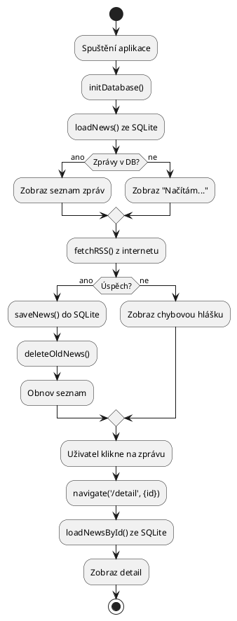
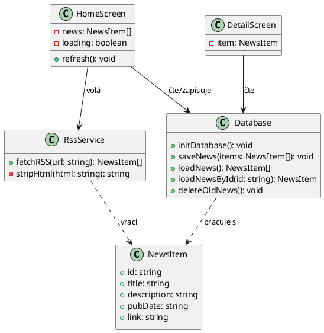

# III. Vývoj mobilní aplikace – React Native + Expo (iOS)

> Cheat-sheet pro státnici. RSS čtečka jako ukázková úloha.
> Stack: React Native, Expo Go na **iOS**, SQLite, REST/RSS.
>
> ⚠️ **iOS specifika oproti Androidu:** jiná oprávnění (Info.plist místo Manifest),
> background fetch OS sám omezuje a negarantuje interval,
> Expo Go na iOS nepodporuje background tasks vůbec – nutno použít development build.

---

## Obsah
0. [Rychlý start](#0-rychlý-start--spuštění-prostředí)
1. [Projekt – setup a struktura](#1-projekt--setup-a-struktura)
2. [Základy React Native](#2-základy-react-native)
3. [Navigace – dvě aktivity (obrazovky)](#3-navigace--dvě-aktivity-obrazovky)
4. [Zpracování RSS / XML a JSON](#4-zpracování-rss--xml-a-json)
5. [SQLite – persistentní ukládání](#5-sqlite--persistentní-ukládání)
6. [Senzory a poziční služby](#6-senzory-a-poziční-služby)
7. [Činnost na pozadí – automatická aktualizace](#7-činnost-na-pozadí--automatická-aktualizace)
8. [UML diagramy](#8-uml-diagramy)
9. [Ukázková úloha – RSS čtečka kompletně](#9-ukázková-úloha--rss-čtečka-kompletně)

---

## 0. Rychlý start – spuštění prostředí

### Požadavky
- Node.js >= 22.13.0
- Expo Go na iPhonu (App Store)

### 1. Vytvoř projekt
```bash
npx create-expo-app nazev-projektu
cd nazev-projektu
```
> Při výběru šablony zvol **"For learning with Expo Go (SDK 54)"**

### 2. Nainstaluj závislosti
```bash
npx expo install expo-sqlite expo-location expo-sensors
```

### 3. Spusť projekt
```bash
npx expo start
```
Naskenuj QR kód v Expo Go na iPhonu.

### 4. Přidání dalších balíčků
```bash
# Expo balíčky (správná verze pro SDK)
npx expo install název-balíčku

# Ostatní npm balíčky
npm install název-balíčku
```

### Struktura projektu
```
app/            ← obrazovky (expo-router)
services/       ← logika (databáze, API)
hooks/          ← custom hooks
components/     ← znovupoužitelné komponenty
```

### Časté příkazy
```bash
npx expo start          # spuštění
npx expo start --clear  # spuštění s vymazáním cache
```

---
## 1. Projekt – setup a struktura

```bash
# Vytvoření projektu
npx create-expo-app rss-reader
cd rss-reader

# Spuštění (naskenuj QR kód v Expo Go na telefonu)
npx expo start

# Instalace závislostí
npx expo install expo-sqlite          # SQLite databáze
npx expo install expo-location        # GPS / poziční služby
npx expo install expo-sensors         # akcelerometr, gyroskop, ...
npx expo install expo-background-fetch expo-task-manager  # pozadí
npx expo install @react-navigation/native @react-navigation/native-stack
npx expo install react-native-screens react-native-safe-area-context
npm install react-native-xml2js       # parsování XML/RSS
```

### Doporučená struktura projektu
```
rss-reader/
├── app/                    # nebo src/screens/
│   ├── index.tsx           # Seznam zpráv (hlavní obrazovka)
│   └── detail.tsx          # Detail zprávy
├── components/
│   └── NewsItem.tsx        # Jeden řádek v seznamu
├── services/
│   ├── rssService.ts       # Načtení + parsování RSS
│   └── database.ts         # SQLite operace
├── hooks/
│   └── useNews.ts          # Logika načítání dat
├── app.json
└── package.json
```

---

## 2. Základy React Native

### Základní komponenty (iOS / Swift ekvivalenty)
```
iOS / Swift              React Native
──────────────────────────────────────────
UIViewController      →  Screen (komponenta)
UILabel               →  <Text>
UIImageView           →  <Image>
UIStackView           →  <View> (flexbox)
UITableView           →  <FlatList>
UIButton              →  <TouchableOpacity> / <Pressable>
segue / push          →  router.push()
UserDefaults          →  AsyncStorage
Core Data / FMDB      →  expo-sqlite
BGAppRefreshTask      →  expo-background-fetch
CLLocationManager     →  expo-location
CMMotionManager       →  expo-sensors
Info.plist            →  app.json → ios.infoPlist
```

### Jednoduchá komponenta
```tsx
import { View, Text, StyleSheet, TouchableOpacity } from 'react-native';

// Props = parametry komponenty (jako konstruktor v Javě)
type NewsItemProps = {
  title: string;
  date: string;
  onPress: () => void;
};

export default function NewsItem({ title, date, onPress }: NewsItemProps) {
  return (
    <TouchableOpacity style={styles.container} onPress={onPress}>
      <Text style={styles.title}>{title}</Text>
      <Text style={styles.date}>{date}</Text>
    </TouchableOpacity>
  );
}

const styles = StyleSheet.create({
  container: {
    padding: 12,
    borderBottomWidth: 1,
    borderBottomColor: '#eee',
    backgroundColor: '#fff',
  },
  title: { fontSize: 16, fontWeight: 'bold', marginBottom: 4 },
  date:  { fontSize: 12, color: '#888' },
});
```

### State a useEffect (životní cyklus)
```tsx
import { useState, useEffect } from 'react';

export default function MyScreen() {
  const [data, setData]       = useState<string[]>([]);
  const [loading, setLoading] = useState(true);

  // useEffect = componentDidMount + componentDidUpdate
  useEffect(() => {
    // Spustí se jednou při načtení komponenty (prázdné deps [])
    fetchData();
  }, []);   // [] = jen při prvním renderu; [value] = při změně value

  async function fetchData() {
    setLoading(true);
    try {
      const result = await someAsyncOperation();
      setData(result);
    } catch (e) {
      console.error(e);
    } finally {
      setLoading(false);
    }
  }

  if (loading) return <Text>Načítám...</Text>;
  return <Text>Hotovo: {data.length} položek</Text>;
}
```

### FlatList – ekvivalent RecyclerView
```tsx
import { FlatList, View, Text } from 'react-native';

type Item = { id: string; title: string };

export default function ListScreen() {
  const items: Item[] = [
    { id: '1', title: 'Zpráva 1' },
    { id: '2', title: 'Zpráva 2' },
  ];

  return (
    <FlatList
      data={items}
      keyExtractor={(item) => item.id}
      renderItem={({ item }) => (
        <View style={{ padding: 12 }}>
          <Text>{item.title}</Text>
        </View>
      )}
      // Oddělující čára mezi položkami
      ItemSeparatorComponent={() => (
        <View style={{ height: 1, backgroundColor: '#eee' }} />
      )}
      // Zobrazí se, když je seznam prázdný
      ListEmptyComponent={<Text>Žádné zprávy.</Text>}
    />
  );
}
```

---

## 3. Navigace – dvě aktivity (obrazovky)

```tsx
// app/_layout.tsx  – kořen navigace
import { Stack } from 'expo-router';

export default function RootLayout() {
  return (
    <Stack>
      <Stack.Screen name="index"  options={{ title: 'RSS Čtečka' }} />
      <Stack.Screen name="detail" options={{ title: 'Detail zprávy' }} />
    </Stack>
  );
}
```

```tsx
// app/index.tsx – Obrazovka 1: seznam
import { useRouter } from 'expo-router';

export default function HomeScreen() {
  const router = useRouter();

  function openDetail(id: string) {
    // Přechod na druhou obrazovku s parametrem (jako Intent.putExtra)
    router.push({ pathname: '/detail', params: { id } });
  }

  return (
    <FlatList
      data={news}
      renderItem={({ item }) => (
        <NewsItem
          title={item.title}
          date={item.pubDate}
          onPress={() => openDetail(item.id)}
        />
      )}
    />
  );
}
```

```tsx
// app/detail.tsx – Obrazovka 2: detail
import { useLocalSearchParams } from 'expo-router';

export default function DetailScreen() {
  const { id } = useLocalSearchParams<{ id: string }>();
  const [item, setItem] = useState<NewsItem | null>(null);

  useEffect(() => {
    loadFromDb(id).then(setItem);
  }, [id]);

  if (!item) return <Text>Načítám...</Text>;

  return (
    <ScrollView style={{ padding: 16 }}>
      <Text style={{ fontSize: 20, fontWeight: 'bold' }}>{item.title}</Text>
      <Text style={{ color: '#888', marginVertical: 8 }}>{item.pubDate}</Text>
      <Text>{item.description}</Text>
    </ScrollView>
  );
}
```

---

## 4. Zpracování RSS / XML a JSON

### RSS je XML – struktura
```xml
<rss version="2.0">
  <channel>
    <title>iDnes.cz</title>
    <item>
      <title>Název zprávy</title>
      <description>Popis zprávy...</description>
      <pubDate>Mon, 20 May 2024 10:00:00 +0000</pubDate>
      <link>https://...</link>
      <guid>unikátní-id</guid>
    </item>
  </channel>
</rss>
```

### Načtení a parsování RSS
```ts
// services/rssService.ts
import { parseString } from 'react-native-xml2js';

export type NewsItem = {
  id:          string;
  title:       string;
  description: string;
  pubDate:     string;
  link:        string;
};

export async function fetchRSS(url: string): Promise<NewsItem[]> {
  // 1. Stáhni XML
  const response = await fetch(url);
  const xml      = await response.text();

  // 2. Parsuj XML → JS objekt
  return new Promise((resolve, reject) => {
    parseString(xml, { explicitArray: false }, (err: any, result: any) => {
      if (err) { reject(err); return; }

      const items = result?.rss?.channel?.item ?? [];
      const arr   = Array.isArray(items) ? items : [items];

      const news: NewsItem[] = arr.map((item: any) => ({
        id:          item.guid?._  ?? item.guid  ?? item.link,
        title:       stripHtml(item.title       ?? ''),
        description: stripHtml(item.description ?? ''),
        pubDate:     item.pubDate ?? '',
        link:        item.link    ?? '',
      }));

      resolve(news);
    });
  });
}

// Odstraní HTML tagy z textu
function stripHtml(html: string): string {
  return html.replace(/<[^>]*>/g, '').trim();
}
```

### Práce s JSON (pro REST API)
```ts
// Obecný fetch s JSON
async function fetchJson<T>(url: string): Promise<T> {
  const response = await fetch(url, {
    headers: { 'Content-Type': 'application/json' },
  });
  if (!response.ok) throw new Error(`HTTP ${response.status}`);
  return response.json() as Promise<T>;
}

// Použití
type Post = { id: number; title: string; body: string };
const posts = await fetchJson<Post[]>('https://jsonplaceholder.typicode.com/posts');
```

---

## 5. SQLite – persistentní ukládání

```ts
// services/database.ts
import * as SQLite from 'expo-sqlite';

// Otevření / vytvoření databáze
const db = SQLite.openDatabaseSync('rss.db');

// Inicializace tabulky (spustit při startu aplikace)
export function initDatabase() {
  db.execSync(`
    CREATE TABLE IF NOT EXISTS news (
      id          TEXT PRIMARY KEY,
      title       TEXT NOT NULL,
      description TEXT,
      pubDate     TEXT,
      link        TEXT,
      fetchedAt   INTEGER DEFAULT (strftime('%s','now'))
    );
  `);
}

// Vložení zpráv (INSERT OR REPLACE = upsert)
export function saveNews(items: NewsItem[]) {
  for (const item of items) {
    db.runSync(
      `INSERT OR REPLACE INTO news (id, title, description, pubDate, link)
       VALUES (?, ?, ?, ?, ?)`,
      [item.id, item.title, item.description, item.pubDate, item.link]
    );
  }
}

// Načtení zpráv (jen posledních 7 dní = časově relevantní)
export function loadNews(): NewsItem[] {
  const weekAgo = Math.floor(Date.now() / 1000) - 7 * 24 * 3600;
  return db.getAllSync<NewsItem>(
    `SELECT * FROM news
     WHERE fetchedAt > ?
     ORDER BY fetchedAt DESC`,
    [weekAgo]
  );
}

// Načtení jedné zprávy podle id
export function loadNewsById(id: string): NewsItem | null {
  return db.getFirstSync<NewsItem>(
    `SELECT * FROM news WHERE id = ?`, [id]
  ) ?? null;
}

// Smazání starých zpráv
export function deleteOldNews() {
  const weekAgo = Math.floor(Date.now() / 1000) - 7 * 24 * 3600;
  db.runSync(`DELETE FROM news WHERE fetchedAt < ?`, [weekAgo]);
}
```

---

## 6. Senzory a poziční služby

### GPS – expo-location
```ts
import * as Location from 'expo-location';

export async function getCurrentLocation() {
  // 1. Vždy nejdřív žádat o oprávnění!
  const { status } = await Location.requestForegroundPermissionsAsync();
  if (status !== 'granted') {
    console.warn('Oprávnění k poloze zamítnuto');
    return null;
  }

  // 2. Získání polohy
  const location = await Location.getCurrentPositionAsync({
    accuracy: Location.Accuracy.Balanced,
  });

  return {
    lat: location.coords.latitude,
    lon: location.coords.longitude,
    accuracy: location.coords.accuracy,
  };
}

// Použití v komponentě
export default function LocationScreen() {
  const [coords, setCoords] = useState<{ lat: number; lon: number } | null>(null);

  async function getLocation() {
    const loc = await getCurrentLocation();
    if (loc) setCoords(loc);
  }

  return (
    <View>
      <Button title="Zjistit polohu" onPress={getLocation} />
      {coords && (
        <Text>Lat: {coords.lat.toFixed(5)}, Lon: {coords.lon.toFixed(5)}</Text>
      )}
    </View>
  );
}
```

### Akcelerometr – expo-sensors
```ts
import { Accelerometer } from 'expo-sensors';
import { useState, useEffect } from 'react';

export default function SensorScreen() {
  const [data, setData] = useState({ x: 0, y: 0, z: 0 });

  useEffect(() => {
    // Nastav interval vzorkování (ms)
    Accelerometer.setUpdateInterval(500);

    // Přihlas odběr dat
    const subscription = Accelerometer.addListener(setData);

    // Odhlásit při odpojení komponenty!
    return () => subscription.remove();
  }, []);

  return (
    <View>
      <Text>X: {data.x.toFixed(3)}</Text>
      <Text>Y: {data.y.toFixed(3)}</Text>
      <Text>Z: {data.z.toFixed(3)}</Text>
    </View>
  );
}
```

---

## 7. Činnost na pozadí – automatická aktualizace

### ⚠️ iOS a Expo Go – důležité omezení
```
Expo Go na iOS NEPODPORUJE background fetch.
→ Pro testování background tasku nutno použít development build:
    npx expo run:ios

iOS samo rozhoduje, kdy task spustí (machine learning based scheduling).
minimumInterval je jen hint – iOS může čekat i hodiny.
→ Pro státnici: hlavní refresh je manuální (pull-to-refresh / tlačítko),
  background task je bonus / demonstrace znalosti.
```

```ts
// services/backgroundTask.ts
import * as BackgroundFetch from 'expo-background-fetch';
import * as TaskManager from 'expo-task-manager';
import { fetchRSS } from './rssService';
import { saveNews, deleteOldNews } from './database';

const TASK_NAME = 'rss-refresh';
const RSS_URL   = 'https://www.idnes.cz/rss/zpravy';

// 1. Definice úlohy – MUSÍ být na top-level souboru (ne uvnitř funkce!)
TaskManager.defineTask(TASK_NAME, async () => {
  try {
    const news = await fetchRSS(RSS_URL);
    deleteOldNews();
    saveNews(news);
    console.log(`[BG] Načteno ${news.length} zpráv`);
    return BackgroundFetch.BackgroundFetchResult.NewData;
  } catch {
    return BackgroundFetch.BackgroundFetchResult.Failed;
  }
});

// 2. Registrace
export async function registerBackgroundTask() {
  const status = await BackgroundFetch.getStatusAsync();

  // iOS může vrátit Restricted (např. Low Power Mode) – pak nic neděláme
  if (status === BackgroundFetch.BackgroundFetchStatus.Restricted) {
    console.warn('[BG] Background fetch omezen systémem (Low Power Mode?)');
    return;
  }

  const isRegistered = await TaskManager.isTaskRegisteredAsync(TASK_NAME);
  if (isRegistered) return;   // nezaregistruj dvakrát

  await BackgroundFetch.registerTaskAsync(TASK_NAME, {
    minimumInterval: 15 * 60,   // iOS bere jako hint, ne závazek
    stopOnTerminate: false,
    startOnBoot: false,         // iOS toto ignoruje – nemá "boot" jako Android
  });
}

// 3. Zrušení
export async function unregisterBackgroundTask() {
  await BackgroundFetch.unregisterTaskAsync(TASK_NAME);
}
```

```tsx
// app/_layout.tsx – registrace při startu
import { useEffect } from 'react';
import { initDatabase } from '../services/database';
import { registerBackgroundTask } from '../services/backgroundTask';

export default function RootLayout() {
  useEffect(() => {
    initDatabase();
    registerBackgroundTask();
  }, []);

  return <Stack />;
}
```

---

## 8. UML diagramy

### Diagram aktivit – tok dat RSS čtečky (PlantUML)


### Diagram tříd – klíčové typy (PlantUML)


---

## 9. Ukázková úloha – RSS čtečka kompletně

### hooks/useNews.ts – veškerá logika na jednom místě
```ts
import { useState, useEffect, useCallback } from 'react';
import { fetchRSS }                         from '../services/rssService';
import { saveNews, loadNews, deleteOldNews } from '../services/database';
import type { NewsItem }                    from '../services/rssService';

const RSS_URL = 'https://www.idnes.cz/rss/zpravy';

export function useNews() {
  const [news, setNews]       = useState<NewsItem[]>([]);
  const [loading, setLoading] = useState(false);
  const [error, setError]     = useState<string | null>(null);

  // Načti z DB při startu
  useEffect(() => {
    setNews(loadNews());
  }, []);

  // Manuální nebo automatické obnovení
  const refresh = useCallback(async () => {
    setLoading(true);
    setError(null);
    try {
      const fresh = await fetchRSS(RSS_URL);
      deleteOldNews();
      saveNews(fresh);
      setNews(loadNews());
    } catch (e) {
      setError('Nepodařilo se načíst zprávy. Zobrazuji offline data.');
    } finally {
      setLoading(false);
    }
  }, []);

  return { news, loading, error, refresh };
}
```

### app/index.tsx – hlavní obrazovka
```tsx
import { View, Text, FlatList, Button, StyleSheet } from 'react-native';
import { useRouter } from 'expo-router';
import { useNews }   from '../hooks/useNews';
import NewsItem      from '../components/NewsItem';

export default function HomeScreen() {
  const router            = useRouter();
  const { news, loading, error, refresh } = useNews();

  return (
    <View style={styles.container}>
      {error   && <Text style={styles.error}>{error}</Text>}
      {loading && <Text style={styles.info}>Načítám zprávy...</Text>}

      <FlatList
        data={news}
        keyExtractor={(item) => item.id}
        renderItem={({ item }) => (
          <NewsItem
            title={item.title}
            date={item.pubDate}
            onPress={() => router.push({ pathname: '/detail', params: { id: item.id } })}
          />
        )}
        ListEmptyComponent={
          <Text style={styles.info}>Žádné zprávy. Klikni Obnovit.</Text>
        }
        refreshing={loading}
        onRefresh={refresh}          // pull-to-refresh
      />

      <View style={styles.button}>
        <Button title="Obnovit zprávy" onPress={refresh} />
      </View>
    </View>
  );
}

const styles = StyleSheet.create({
  container: { flex: 1, backgroundColor: '#f5f5f5' },
  error:     { padding: 8, backgroundColor: '#ffcccc', color: 'red' },
  info:      { padding: 16, textAlign: 'center', color: '#888' },
  button:    { padding: 12 },
});
```

### app/detail.tsx – detail zprávy
```tsx
import { View, Text, ScrollView, Linking, Button, StyleSheet } from 'react-native';
import { useLocalSearchParams } from 'expo-router';
import { useEffect, useState }  from 'react';
import { loadNewsById }         from '../services/database';
import type { NewsItem }        from '../services/rssService';

export default function DetailScreen() {
  const { id }              = useLocalSearchParams<{ id: string }>();
  const [item, setItem]     = useState<NewsItem | null>(null);

  useEffect(() => {
    if (id) setItem(loadNewsById(id));
  }, [id]);

  if (!item) return <Text style={{ padding: 16 }}>Zpráva nenalezena.</Text>;

  return (
    <ScrollView style={styles.container}>
      <Text style={styles.title}>{item.title}</Text>
      <Text style={styles.date}>{item.pubDate}</Text>
      <Text style={styles.body}>{item.description}</Text>
      <Button
        title="Otevřít v prohlížeči"
        onPress={() => Linking.openURL(item.link)}
      />
    </ScrollView>
  );
}

const styles = StyleSheet.create({
  container: { flex: 1, padding: 16, backgroundColor: '#fff' },
  title:     { fontSize: 20, fontWeight: 'bold', marginBottom: 8 },
  date:      { color: '#888', marginBottom: 12 },
  body:      { fontSize: 15, lineHeight: 22, marginBottom: 16 },
});
```

### app.json – iOS oprávnění (Info.plist)
```json
{
  "expo": {
    "name": "RSS Čtečka",
    "ios": {
      "bundleIdentifier": "com.yourname.rssreader",
      "infoPlist": {
        "NSLocationWhenInUseUsageDescription": "Aplikace potřebuje polohu pro lokální zprávy.",
        "NSLocationAlwaysUsageDescription": "Aplikace potřebuje polohu i na pozadí.",
        "UIBackgroundModes": ["fetch"]
      }
    },
    "plugins": [
      [
        "expo-location",
        {
          "locationWhenInUsePermission": "Aplikace potřebuje přístup k poloze.",
          "locationAlwaysPermission": "Aplikace potřebuje polohu i na pozadí."
        }
      ]
    ]
  }
}
```

> **Pozor:** `UIBackgroundModes: ["fetch"]` je nutný pro background task na iOS.
> Expo ho přidá automaticky při použití `expo-background-fetch`, ale jen v development / production buildu – ne v Expo Go.
```

### Silné a slabé stránky řešení
```
✅ Silné stránky:
  - Offline režim: zprávy z SQLite dostupné bez internetu
  - Pull-to-refresh + tlačítko Obnovit (spolehlivé na iOS)
  - Automatické čištění starých zpráv (7 dní)
  - Expo Go: rychlé testování bez kompilace na iPhone

⚠️ Slabé stránky (iOS specifické):
  - Background fetch: iOS negarantuje interval, spouští dle vlastní logiky
  - Background task NEFUNGUJE v Expo Go → nutný development build (npx expo run:ios)
  - Všechna oprávnění (poloha, senzory) musí mít popis v Info.plist – jinak crash
  - RSS z různých zdrojů má různou strukturu XML → parsování může selhat
  - fetch() na iOS blokuje HTTP (ne HTTPS) – RSS musí být přes HTTPS
    nebo přidat NSAppTransportSecurity výjimku do Info.plist
```

---

## Rychlá reference – časté chyby

```ts
// ❌ Volání async přímo v useEffect
useEffect(async () => { ... }, []);   // ŠPATNĚ – useEffect nesmí být async

// ✅ Správně – async funkce uvnitř
useEffect(() => {
  async function load() { ... }
  load();
}, []);

// ❌ Zapomenutý return pro cleanup senzoru
useEffect(() => {
  const sub = Accelerometer.addListener(setData);
  // chybí return!
}, []);

// ✅ Správně
useEffect(() => {
  const sub = Accelerometer.addListener(setData);
  return () => sub.remove();    // cleanup při odmontování
}, []);

// ❌ TaskManager.defineTask MUSÍ být na top-level, ne uvnitř funkce
function registerTask() {
  TaskManager.defineTask(...);   // ŠPATNĚ
}

// ✅ Správně – na nejvyšší úrovni souboru
TaskManager.defineTask(TASK_NAME, async () => { ... });

// ❌ iOS blokuje HTTP (jen HTTPS povoleno ve výchozím nastavení)
fetch('http://example.com/rss');   // selže na iOS!

// ✅ Vždy HTTPS
fetch('https://www.idnes.cz/rss/zpravy');

// Pokud zdroj nemá HTTPS, přidej do app.json → ios.infoPlist:
// "NSAppTransportSecurity": { "NSAllowsArbitraryLoads": true }
// (jen pro vývoj/státnici, v produkci nepoužívat)
```

---

*React Native · Expo SDK · expo-sqlite · expo-location · expo-sensors · expo-background-fetch · **iOS***