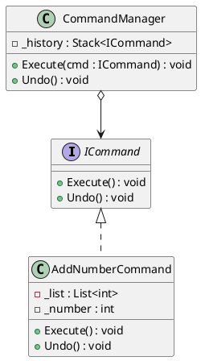
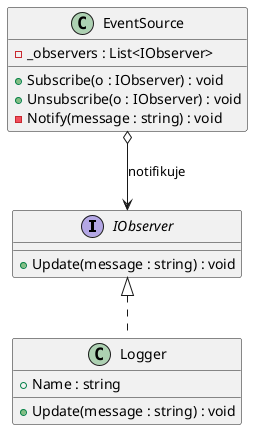

# I. Objektově orientované návrhové vzory (C#)

> Jednoduché implementace všech vzorů. Žádný async, žádné složité hierarchie.
> Vše připravené na rychlé rozšíření přímo na místě.

---

## Obsah
0. [Rychlý start](#0-rychlý-start--spuštění-prostředí)
1. [Typový systém C# – přehled](#1-typový-systém-c--přehled)
2. [Polymorfismus – rozhraní vs dědičnost](#2-polymorfismus--rozhraní-vs-dědičnost)
3. [Vytvářející vzory – Singleton, Factory Method, Prototype](#3-vytvářející-vzory)
4. [Strukturální vzory – Adapter, Decorator, Bridge, Flyweight](#4-strukturální-vzory)
5. [Vzory chování – Command, Observer, Iterator, Memento, Strategy](#5-vzory-chování)
6. [Diagramy tříd – UML notace](#6-diagramy-tříd--uml-notace)
7. [Testování – xUnit](#7-testování--xunit)

---

## 0. Rychlý start – spuštění prostředí

### 1. Vytvoř projekt
```bash
dotnet new console -n oonv --framework net8.0
cd oonv
mkdir Patterns
```

### 2. Spusť projekt
```bash
dotnet run
```

### Přidání xUnit testů
```bash
dotnet new xunit -n oonv.Tests
dotnet add oonv.Tests reference ../oonv/oonv.csproj
dotnet test
```

### SQLite – přidání do projektu
```bash
dotnet add package Microsoft.Data.Sqlite
```

```csharp
using Microsoft.Data.Sqlite;

var db = new SqliteConnection("Data Source=app.db");
db.Open();

// CREATE
var cmd = db.CreateCommand();
cmd.CommandText = """
    CREATE TABLE IF NOT EXISTS Items (
        Id   INTEGER PRIMARY KEY AUTOINCREMENT,
        Name TEXT NOT NULL
    );
    """;
cmd.ExecuteNonQuery();

// INSERT – vždy parametry, nikdy string concatenation
cmd.CommandText = "INSERT INTO Items (Name) VALUES ($name); SELECT last_insert_rowid();";
cmd.Parameters.AddWithValue("$name", "Test");
int newId = Convert.ToInt32(cmd.ExecuteScalar());

// SELECT
cmd.CommandText = "SELECT * FROM Items;";
cmd.Parameters.Clear();
using var reader = cmd.ExecuteReader();
while (reader.Read())
    Console.WriteLine($"{reader.GetInt32(0)}: {reader.GetString(1)}");

// UPDATE
cmd.CommandText = "UPDATE Items SET Name=$name WHERE Id=$id;";
cmd.Parameters.AddWithValue("$name", "Změněno");
cmd.Parameters.AddWithValue("$id", newId);
cmd.ExecuteNonQuery();

// DELETE
cmd.CommandText = "DELETE FROM Items WHERE Id=$id;";
cmd.Parameters.AddWithValue("$id", newId);
cmd.ExecuteNonQuery();

db.Close();
```

> `ExecuteNonQuery()` → INSERT/UPDATE/DELETE  
> `ExecuteScalar()` → jeden výsledek (COUNT, last_insert_rowid)  
> `ExecuteReader()` → více řádků

---

## 1. Typový systém C# – přehled

```csharp
// Hodnotové typy → uloženy na zásobníku, kopírují se při předání
int, double, float, bool, char, decimal, struct, enum

// Referenční typy → uloženy na haldě, předává se reference
class, interface, string, array, List<T>

// Specifikátory přístupu
public           // přístup odkudkoli
private          // jen uvnitř třídy (default pro členy třídy)
protected        // třída + odvozené třídy
internal         // jen v rámci sestavy (assembly)

// Klíčová slova pro dědičnost
abstract         // třída nebo metoda bez implementace – MUSÍ být přepsána
virtual          // metoda s implementací – MŮŽE být přepsána
override         // přepis virtual/abstract metody v potomkovi
sealed           // nelze od třídy dědit
```

---

## 2. Polymorfismus – rozhraní vs dědičnost

### Rozhraní – sdílená smlouva (BEZ implementace)
```csharp
public interface IAnimal
{
    void Speak();        // žádná implementace
    string Name { get; }
}

public class Dog : IAnimal
{
    public string Name => "Pes";
    public void Speak() => Console.WriteLine("Haf!");
}

public class Cat : IAnimal
{
    public string Name => "Kočka";
    public void Speak() => Console.WriteLine("Mňau!");
}

// Polymorfismus: pracuji s IAnimal, nezáleží na konkrétní třídě
IAnimal animal = new Dog();
animal.Speak();    // "Haf!"

animal = new Cat();
animal.Speak();    // "Mňau!"

// Třída může implementovat více rozhraní najednou
public class Duck : IAnimal, IFlyable { ... }
```

### Dědičnost – specializace (S implementací)
```csharp
public abstract class Shape
{
    public string Color { get; set; } = "Červená";
    public abstract double Area();                      // MUSÍ být přepsáno
    public virtual void Print()                         // MŮŽE být přepsáno
        => Console.WriteLine($"{Color} tvar, plocha: {Area():F2}");
}

public class Circle : Shape
{
    public double Radius { get; set; }
    public override double Area() => Math.PI * Radius * Radius;
}

public class Rectangle : Shape
{
    public double Width { get; set; }
    public double Height { get; set; }
    public override double Area() => Width * Height;
    public override void Print()
    {
        base.Print();    // zavolá rodičovskou verzi
        Console.WriteLine($"  (rozměry: {Width}×{Height})");
    }
}

// Použití
Shape s = new Circle { Radius = 5, Color = "Modrá" };
s.Print();    // "Modrá tvar, plocha: 78.54"
```

---

## 3. Vytvářející vzory

### Singleton – Jedináček
```
Účel: zajistit, že třída má jen JEDNU instanci (konfigurace, logger)
Klíč: private konstruktor + static property Instance
```

```csharp
public class AppConfig
{
    private static AppConfig? _instance;
    public static AppConfig Instance => _instance ??= new AppConfig();

    public string AppName { get; set; } = "MojeAplikace";
    public bool DebugMode { get; set; } = false;

    private AppConfig() { }    // nikdo zvenku nemůže volat new AppConfig()
}

// Použití – vždy stejná instance
AppConfig.Instance.DebugMode = true;
Console.WriteLine(AppConfig.Instance.AppName);    // "MojeAplikace"
// AppConfig.Instance == AppConfig.Instance → vždy true
```

---

### Factory Method – Tovární metoda
```
Účel: přesunout zodpovědnost za vytváření objektů do odvozených tříd
Klíč: abstraktní CreateProduct() – každá podtřída vrací svůj typ
```

```csharp
// Produkt
public abstract class Animal
{
    public abstract void Speak();
}

public class Dog : Animal
{
    public override void Speak() => Console.WriteLine("Haf!");
}

public class Cat : Animal
{
    public override void Speak() => Console.WriteLine("Mňau!");
}

// Továrna – abstraktní
public abstract class AnimalFactory
{
    public abstract Animal Create();

    // Šablonová metoda – společná logika kolem tovární metody
    public void CreateAndSpeak()
    {
        var animal = Create();
        Console.Write("Nové zvíře říká: ");
        animal.Speak();
    }
}

public class DogFactory : AnimalFactory
{
    public override Animal Create() => new Dog();
}

public class CatFactory : AnimalFactory
{
    public override Animal Create() => new Cat();
}

// Použití
AnimalFactory factory = new DogFactory();
factory.CreateAndSpeak();    // "Nové zvíře říká: Haf!"

factory = new CatFactory();
factory.CreateAndSpeak();    // "Nové zvíře říká: Mňau!"
```

---

### Prototype – Prototyp
```
Účel: kopírování existujícího objektu bez závislosti na jeho třídě
Klíč: metoda Clone() – pozor na mělkou vs hlubokou kopii
```

```csharp
public class Contact
{
    public string Name  { get; set; } = "";
    public string Phone { get; set; } = "";

    // Mělká kopie – pro jednoduché typy (string, int) stačí
    public Contact Clone() => new Contact { Name = Name, Phone = Phone };
}

// Použití
var original = new Contact { Name = "Jan", Phone = "123 456 789" };
var kopie    = original.Clone();

kopie.Name = "Petr";    // nezměňuje originál

Console.WriteLine(original.Name);    // "Jan"
Console.WriteLine(kopie.Name);       // "Petr"
```

> **Mělká vs hluboká kopie:**
> Mělká (`MemberwiseClone`) – kopíruje hodnoty polí; vnořené objekty (třídy) jsou stále sdíleny.
> Hluboká – rekurzivně vytváří nové kopie i vnořených objektů. Nutná když objekt obsahuje jiné třídy jako pole.

---

## 4. Strukturální vzory

### Adapter – Adaptér
```
Účel: umožnit spolupráci dvou tříd s nekompatibilními rozhraními
Klíč: obalová třída překládá volání z jednoho rozhraní na druhé
```

```csharp
// Co klient očekává
public interface ILogger
{
    void Log(string message);
}

// Stará třída, kterou nemůžeme změnit
public class OldPrinter
{
    public void PrintLine(string text) => Console.WriteLine($"[PRINT] {text}");
}

// Adaptér – OldPrinter začne fungovat jako ILogger
public class PrinterAdapter : ILogger
{
    private readonly OldPrinter _printer = new();
    public void Log(string message) => _printer.PrintLine(message);
}

// Použití – klient zná jen ILogger
ILogger logger = new PrinterAdapter();
logger.Log("Aplikace spuštěna");    // "[PRINT] Aplikace spuštěna"
```

---

### Decorator – Dekorátor
```
Účel: dynamicky přidávat chování objektu bez změny jeho třídy
Klíč: obalová třída implementuje stejné rozhraní a volá vnitřní objekt
```

```csharp
public interface IMessage
{
    string GetText();
}

public class SimpleMessage : IMessage
{
    private readonly string _text;
    public SimpleMessage(string text) => _text = text;
    public string GetText() => _text;
}

// Dekorátor přidá hranaté závorky
public class BracketDecorator : IMessage
{
    private readonly IMessage _inner;
    public BracketDecorator(IMessage inner) => _inner = inner;
    public string GetText() => $"[{_inner.GetText()}]";
}

// Dekorátor přidá vykřičník
public class ExclamationDecorator : IMessage
{
    private readonly IMessage _inner;
    public ExclamationDecorator(IMessage inner) => _inner = inner;
    public string GetText() => _inner.GetText() + "!!!";
}

// Skládání – pořadí záleží
IMessage msg = new SimpleMessage("Ahoj");
msg = new BracketDecorator(msg);
msg = new ExclamationDecorator(msg);

Console.WriteLine(msg.GetText());    // "[Ahoj]!!!"
```

---

### Bridge – Most
```
Účel: oddělit abstrakci od implementace, obě mohou měnit se nezávisle
Klíč: abstrakce drží referenci na implementaci (kompozice)
```

```csharp
// Implementační rozhraní
public interface IRenderer
{
    void Render(string shape);
}

public class ConsoleRenderer : IRenderer
{
    public void Render(string shape) => Console.WriteLine($"Kreslím na konzoli: {shape}");
}

public class FileRenderer : IRenderer
{
    public void Render(string shape) => Console.WriteLine($"Ukládám do souboru: {shape}");
}

// Abstrakce drží referenci na implementaci
public abstract class Shape
{
    protected IRenderer _renderer;
    protected Shape(IRenderer renderer) => _renderer = renderer;
    public abstract void Draw();
}

public class Circle : Shape
{
    public Circle(IRenderer renderer) : base(renderer) { }
    public override void Draw() => _renderer.Render("Kruh");
}

public class Square : Shape
{
    public Square(IRenderer renderer) : base(renderer) { }
    public override void Draw() => _renderer.Render("Čtverec");
}

// Použití – lze kombinovat libovolně
new Circle(new ConsoleRenderer()).Draw();    // "Kreslím na konzoli: Kruh"
new Circle(new FileRenderer()).Draw();       // "Ukládám do souboru: Kruh"
new Square(new ConsoleRenderer()).Draw();    // "Kreslím na konzoli: Čtverec"
```

---

### Flyweight – Muší váha
```
Účel: sdílet společná data mezi mnoha objekty → úspora paměti
Klíč: oddělit sdílený (intrinsic) a unikátní (extrinsic) stav
```

```csharp
// Sdílený (neměnný) stav – vytvořen jen jednou pro každou barvu
public class TreeType
{
    public string Name  { get; }
    public string Color { get; }
    public TreeType(string name, string color)
        => (Name, Color) = (name, color);

    public void Display(int x, int y)
        => Console.WriteLine($"Strom '{Name}' ({Color}) na [{x},{y}]");
}

// Factory – sdílí instance TreeType
public class TreeFactory
{
    private readonly Dictionary<string, TreeType> _cache = new();

    public TreeType Get(string name, string color)
    {
        var key = $"{name}_{color}";
        if (!_cache.ContainsKey(key))
            _cache[key] = new TreeType(name, color);
        return _cache[key];
    }
}

// Každý strom má unikátní pozici, ale SDÍLÍ TreeType
public class Tree
{
    public int X { get; set; }
    public int Y { get; set; }
    public TreeType Type { get; set; }    // sdílená reference!

    public void Display() => Type.Display(X, Y);
}

// Použití
var factory = new TreeFactory();
var trees = new List<Tree>
{
    new() { X=1, Y=2, Type = factory.Get("Dub", "Zelená") },
    new() { X=5, Y=8, Type = factory.Get("Dub", "Zelená") },   // stejný TreeType objekt
    new() { X=3, Y=1, Type = factory.Get("Borovice", "Tmavá") },
};
// factory má jen 2 TreeType objekty, ne 3
```

---

## 5. Vzory chování

### Command – Příkaz
```
Účel: zapouzdřit akci jako objekt → undo/redo, historie
Klíč: rozhraní ICommand s Execute() a Undo()
```

```csharp
public interface ICommand
{
    void Execute();
    void Undo();
}

// Jednoduchý příkaz – přidání čísla do seznamu
public class AddNumberCommand : ICommand
{
    private readonly List<int> _list;
    private readonly int _number;

    public AddNumberCommand(List<int> list, int number)
        => (_list, _number) = (list, number);

    public void Execute()
    {
        _list.Add(_number);
        Console.WriteLine($"Přidáno: {_number}");
    }

    public void Undo()
    {
        _list.Remove(_number);
        Console.WriteLine($"Vráceno: {_number}");
    }
}

// Invoker – spravuje historii příkazů
public class CommandManager
{
    private readonly Stack<ICommand> _history = new();

    public void Execute(ICommand cmd)
    {
        cmd.Execute();
        _history.Push(cmd);
    }

    public void Undo()
    {
        if (_history.Count == 0) { Console.WriteLine("Nic k vrácení."); return; }
        _history.Pop().Undo();
    }
}

// Použití
var numbers = new List<int>();
var manager = new CommandManager();

manager.Execute(new AddNumberCommand(numbers, 10));   // Přidáno: 10
manager.Execute(new AddNumberCommand(numbers, 20));   // Přidáno: 20
manager.Undo();                                       // Vráceno: 20
// numbers = [10]
```

---

### Observer – Pozorovatel
```
Účel: automaticky upozornit závislé objekty při změně stavu
Klíč: Subject drží seznam Observerů, volá jejich Update() při změně
```

```csharp
public interface IObserver
{
    void Update(string message);
}

public class EventSource
{
    private readonly List<IObserver> _observers = new();

    public void Subscribe(IObserver o)   => _observers.Add(o);
    public void Unsubscribe(IObserver o) => _observers.Remove(o);

    private void Notify(string message)
    {
        foreach (var o in _observers)
            o.Update(message);
    }

    // Při změně stavu notifikujeme
    private string _status = "";
    public string Status
    {
        get => _status;
        set { _status = value; Notify($"Nový stav: {value}"); }
    }
}

public class Logger : IObserver
{
    public string Name { get; set; } = "";
    public void Update(string message) => Console.WriteLine($"[{Name}] {message}");
}

// Použití
var source = new EventSource();
var logA   = new Logger { Name = "Logger A" };
var logB   = new Logger { Name = "Logger B" };

source.Subscribe(logA);
source.Subscribe(logB);
source.Status = "Spuštěno";
// [Logger A] Nový stav: Spuštěno
// [Logger B] Nový stav: Spuštěno

source.Unsubscribe(logA);
source.Status = "Zastaveno";
// [Logger B] Nový stav: Zastaveno
```

---

### Iterator – Iterátor
```
Účel: procházet kolekci bez znalosti její vnitřní struktury
Klíč: implementace IEnumerable<T> → foreach automaticky funguje
```

```csharp
public class NumberCollection : IEnumerable<int>
{
    private readonly List<int> _numbers = new();

    public void Add(int n) => _numbers.Add(n);

    // Deleguje na List<int> – nejjednodušší implementace
    public IEnumerator<int> GetEnumerator() => _numbers.GetEnumerator();
    System.Collections.IEnumerator System.Collections.IEnumerable.GetEnumerator()
        => GetEnumerator();

    // Vlastní filtrační iterátor pomocí yield return
    public IEnumerable<int> GetEvenNumbers()
    {
        foreach (var n in _numbers)
            if (n % 2 == 0)
                yield return n;    // "lenivé" vracení po jednom
    }
}

// Použití
var col = new NumberCollection();
col.Add(1); col.Add(2); col.Add(3); col.Add(4);

foreach (var n in col)
    Console.Write(n + " ");         // 1 2 3 4

foreach (var n in col.GetEvenNumbers())
    Console.Write(n + " ");         // 2 4
```

---

### Memento – Memo
```
Účel: uložit a obnovit předchozí stav objektu BEZ porušení zapouzdření
Klíč: objekt sám vytváří snapshot (Memento) svého stavu
Rozdíl od Command: Memento ukládá STAV, Command ukládá OPERACI
```

```csharp
// Snapshot stavu – jednoduchý record
public record TextMemento(string Content);

// Originator – vytváří a obnovuje snapshoty
public class TextEditor
{
    public string Content { get; set; } = "";

    public TextMemento Save()         => new(Content);
    public void Restore(TextMemento m) => Content = m.Content;
}

// Caretaker – ukládá historii snapshotů
public class History
{
    private readonly Stack<TextMemento> _snapshots = new();

    public void Backup(TextEditor editor) => _snapshots.Push(editor.Save());
    public void Undo(TextEditor editor)
    {
        if (_snapshots.Count == 0) return;
        editor.Restore(_snapshots.Pop());
    }
}

// Použití
var editor  = new TextEditor();
var history = new History();

editor.Content = "Ahoj";
history.Backup(editor);

editor.Content = "Ahoj světe";
history.Backup(editor);

editor.Content = "Toto smažeme";

history.Undo(editor);
Console.WriteLine(editor.Content);    // "Ahoj světe"

history.Undo(editor);
Console.WriteLine(editor.Content);    // "Ahoj"
```

---

### Strategy – Strategie
```
Účel: záměna algoritmu za běhu bez změny kódu klienta
Klíč: Context drží referenci na IStrategy, lze ji kdykoli vyměnit
```

```csharp
public interface ISortStrategy
{
    void Sort(List<int> data);
    string Name { get; }
}

public class BubbleSort : ISortStrategy
{
    public string Name => "Bubble Sort";
    public void Sort(List<int> data)
    {
        // zjednodušená implementace pro demo
        var sorted = data.OrderBy(x => x).ToList();
        data.Clear(); data.AddRange(sorted);
        Console.WriteLine($"{Name}: {string.Join(", ", data)}");
    }
}

public class ReverseSort : ISortStrategy
{
    public string Name => "Reverse Sort";
    public void Sort(List<int> data)
    {
        data.Sort((a, b) => b.CompareTo(a));
        Console.WriteLine($"{Name}: {string.Join(", ", data)}");
    }
}

public class Sorter
{
    private ISortStrategy _strategy;
    public Sorter(ISortStrategy strategy) => _strategy = strategy;

    public void SetStrategy(ISortStrategy strategy) => _strategy = strategy;
    public void Sort(List<int> data) => _strategy.Sort(data);
}

// Použití
var data   = new List<int> { 5, 2, 8, 1, 9 };
var sorter = new Sorter(new BubbleSort());
sorter.Sort(data);                         // Bubble Sort: 1, 2, 5, 8, 9

sorter.SetStrategy(new ReverseSort());
sorter.Sort(data);                         // Reverse Sort: 9, 8, 5, 2, 1
```

---

## 6. Diagramy tříd – UML notace

```
Viditelnost:
  +  public
  -  private
  #  protected

Vztahy:
  ──────▷   Dědičnost (extends)
  - - -▷    Implementace rozhraní (implements)
  ──────◆   Kompozice (vlastní, zanikne s vlastníkem)
  ──────◇   Agregace (má, ale může existovat bez)
  ──────→   Asociace / závislost
```

### Příklad – Command vzor (PlantUML)


### Příklad – Observer vzor (PlantUML)


---

## 7. Testování – xUnit

```bash
# Vytvoření testovacího projektu
dotnet new xunit -n MyApp.Tests
dotnet add MyApp.Tests reference MyApp/MyApp.csproj
dotnet test
```

```csharp
// MyApp.Tests/CommandTests.cs
public class CommandTests
{
    [Fact]
    public void Execute_AddsNumberToList()
    {
        var list = new List<int>();
        var cmd  = new AddNumberCommand(list, 42);

        cmd.Execute();

        Assert.Single(list);
        Assert.Equal(42, list[0]);
    }

    [Fact]
    public void Undo_RemovesNumberFromList()
    {
        var list = new List<int>();
        var cmd  = new AddNumberCommand(list, 42);

        cmd.Execute();
        cmd.Undo();

        Assert.Empty(list);
    }

    [Fact]
    public void Manager_Undo_WithEmptyHistory_DoesNotThrow()
    {
        var manager = new CommandManager();
        // Nesmí vyhodit výjimku
        manager.Undo();
    }
}

public class PrototypeTests
{
    [Fact]
    public void Clone_CreatesIndependentCopy()
    {
        var original = new Contact { Name = "Jan", Phone = "123" };
        var clone    = original.Clone();

        clone.Name = "Petr";

        Assert.Equal("Jan",  original.Name);   // originál nezměněn
        Assert.Equal("Petr", clone.Name);
    }
}

// [Theory] + [InlineData] pro více vstupů najednou
public class StrategyTests
{
    [Theory]
    [InlineData(new[] { 3, 1, 2 }, new[] { 1, 2, 3 })]
    [InlineData(new[] { 5, 5, 5 }, new[] { 5, 5, 5 })]
    public void BubbleSort_SortsCorrectly(int[] input, int[] expected)
    {
        var data     = input.ToList();
        var strategy = new BubbleSort();

        strategy.Sort(data);

        Assert.Equal(expected, data);
    }
}
```

---

## Přehledová tabulka vzorů

| Vzor | Kategorie | Jednořádkový popis |
|------|-----------|--------------------|
| Singleton | Vytvářející | Jedna globální instance (`private` konstruktor) |
| Factory Method | Vytvářející | Podtřída rozhoduje, co se vytvoří |
| Prototype | Vytvářející | Kopíruj existující objekt místo `new` |
| Adapter | Strukturální | Obal nekompatibilní třídy do rozhraní |
| Decorator | Strukturální | Přidej chování obalením (skládání) |
| Bridge | Strukturální | Odděl abstrakci od implementace |
| Flyweight | Strukturální | Sdílej sdílená data, šetři paměť |
| Command | Chování | Akce jako objekt → undo/redo |
| Observer | Chování | Notifikuj odběratele při změně stavu |
| Iterator | Chování | Procházej kolekci přes `foreach` |
| Memento | Chování | Ulož a obnov stav objektu |
| Strategy | Chování | Vyměň algoritmus za běhu |

---

*C# (.NET 8) · xUnit · PlantUML*